# Readme de compte rendu INFO905 - TP3

- MEZIERE Evan
- CHEVALIER Clément

## Objectif

### Données

L'objectif de ce compte rendu est de détailler les étapes et les choix faits pour entrainer un modèle sur une séquence d'événements de la forme suivante :

| id | sequence | length | survived | category |
|----|----------|--------|----------|----------|
| 10099 | Entree -> Couloir -> Troll -> Couloir -> Dalle_Piege -> Nuage_Toxique -> Piege_a_Pics -> Armure_Ancienne -> Gaz_Toxique -> Zombie -> Sortie | 11 | 1 | hard |


### Paramètres

| Argument | Valeur par défaut | Rôle dans l'entraînement du modèle |
|----------|-------------------|------------------------------------|
| **`--embed_dim`**       | 258               | Définit la dimension des embeddings. Cela influence la capacité du modèle à représenter chaque élément de la séquence (par exemple, chaque étape du parcours). C'est la taille du vecteur créé pour représenter les données. |
| **`--hidden_dim`**      | 258               | Spécifie la taille de l'état caché dans le RNN/LSTM. Cela détermine la quantité d'information que le modèle peut mémoriser au fil des étapes de la séquence. |
| **`--num_layers`**      | 1                 | Nombre de couches dans l'architecture RNN/LSTM. Plus de couches peuvent permettre au modèle de mieux capturer les dépendances complexes dans la séquence. |
| **`--dropout`**         | 0.0               | Taux de dropout entre les couches du RNN/LSTM. Utilisé pour éviter le sur-apprentissage en "éteignant" aléatoirement des neurones pendant l'entraînement. |
| **`--mode`**            | 'linear'          | Choisit l'architecture du modèle : 'linear' (régression ou réseau simple), 'rnn' (réseau de neurones récurrents), 'lstm' (long short-term memory). Cela impacte la capacité à traiter les séquences et à mémoriser des informations sur de longues périodes. |
| **`--bidirectional`**   | False             | Si activé, le modèle traite la séquence dans les deux sens (avant et arrière). Cela peut aider à capturer les relations à la fois passées et futures dans la séquence d'événements. |
| **`--epochs`**          | 6                 | Nombre d'époques d'entraînement. Un nombre plus élevé d'époques permet au modèle de s'ajuster mieux aux données, mais peut présenter un risque d'overfitting. |
| **`--batch_size`**      | 32                | Taille des mini-lots. Un lot plus grand peut accélérer l'entraînement mais augmenter la consommation mémoire, tandis qu'un plus petit peut rendre l'apprentissage plus précis, mais plus lent. |
| **`--learning_rate`**   | 0.1               | Le taux d'apprentissage qui régule la taille des pas lors de la mise à jour des poids. Un taux trop élevé peut entraîner une mauvaise convergence, un taux trop faible peut ralentir l'apprentissage. |
| **`--optimizer`**       | 'sgd'             | Optimiseur à utiliser : 'adam' ou 'sgd'. Adam est souvent plus efficace pour des données complexes et pour les modèles avec des gradients irréguliers. |
| **`--weight_decay`**    | 0.0               | La régularisation L2 (weight decay) aide à éviter l'overfitting en pénalisant des poids trop grands et en avantageant des poids trop faibles. |
| **`--use_scheduler`**   | False             | Active un scheduler pour ajuster le taux d'apprentissage pendant l'entraînement. Cela peut améliorer la convergence en réduisant progressivement le taux d'apprentissage. |
| **`--early_stopping`**  | False             | Active l'arrêt précoce pour stopper l'entraînement si la performance ne s'améliore plus après un certain nombre d'époques, afin d'éviter l'overfitting. |
| **`--patience`**        | 10                | Nombre d'époques sans amélioration avant d'arrêter l'entraînement (utilisé avec `--early_stopping`). Permet de contrôler la tolérance avant de stopper l'entraînement prématurément. |
| **`--plot`**            | True              | Affiche les courbes d'entraînement (par exemple, la perte et l'exactitude). Cela aide à suivre l'évolution du modèle et à vérifier s'il y a des problèmes comme un overfitting. |


## Méthodologie

On fixe la méthodologie suivante pour obtenir les meilleurs paramètres pour le modèle :
- On change les paramètres un par un
- Tant que le résultat n'est pas plus satisfaisant on ajuste le paramètre

### `Cas de base`

> Tous les paramètres utilisent leur valeur par défaut.

```bash
uv run .\train_dungeon_logs.py
```

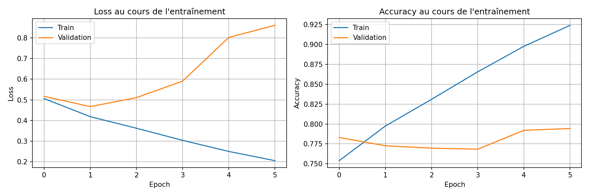

```
  edge_case                     : 100.00% (1 ex.)
  hard                          : 92.59% (540 ex.)
  longterm_with_amulet_hard     : 81.82% (495 ex.)
  longterm_without_amulet_hard  : 47.47% (495 ex.)
  normal_short                  : 89.11% (450 ex.)
  order_trap_die_hard           : 83.12% (480 ex.)
  order_trap_survive_hard       : 81.46% (480 ex.)
  random                        : 86.44% (59 ex.)
Paramètres: 9,397,909
```

### `--embed_dim`

> Objectif : avoir une valeur de paramètre assez grande pour décrire précisement la donnée mais pas trop pour ne pas surcharger le modèle.

* **Iteration 1**
```bash
uv run .\train_dungeon_logs.py --embed_dim 24
```

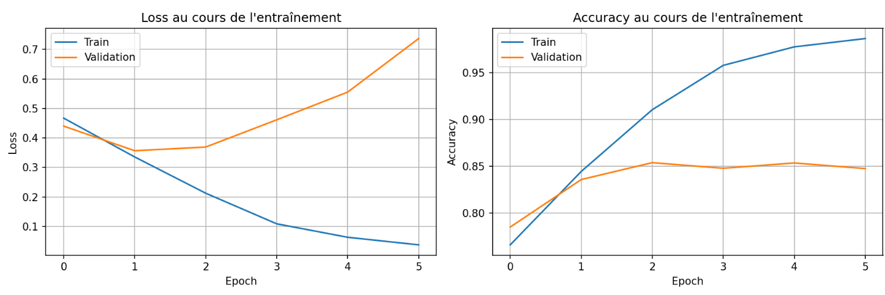

```
  edge_case                     : 100.00% (1 ex.)
  hard                          : 94.07% (540 ex.)
  longterm_with_amulet_hard     : 82.42% (495 ex.)
  longterm_without_amulet_hard  : 69.90% (495 ex.)
  normal_short                  : 92.44% (450 ex.)
  order_trap_die_hard           : 88.33% (480 ex.)
  order_trap_survive_hard       : 80.83% (480 ex.)
  random                        : 88.14% (59 ex.)
Paramètres: 935,299
```

**Iteration 2**
```bash
uv run .\train_dungeon_logs.py --embed_dim 16
```

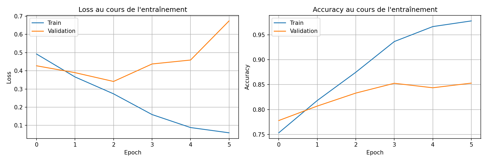

```
  edge_case                     : 100.00% (1 ex.)
  hard                          : 93.15% (540 ex.)
  longterm_with_amulet_hard     : 93.94% (495 ex.)
  longterm_without_amulet_hard  : 60.20% (495 ex.)
  normal_short                  : 93.33% (450 ex.)
  order_trap_die_hard           : 84.58% (480 ex.)
  order_trap_survive_hard       : 85.83% (480 ex.)
  random                        : 91.53% (59 ex.)
Paramètres: 645,979
```

**Iteration 3**
```bash
uv run .\train_dungeon_logs.py --embed_dim 32
```

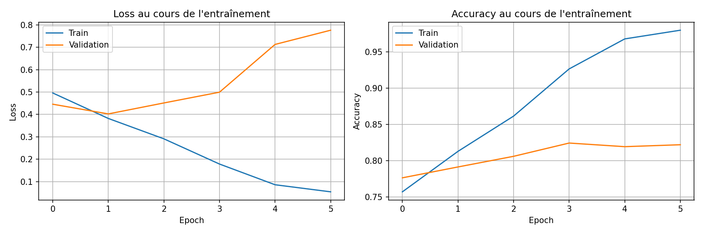

```
  edge_case                     : 100.00% (1 ex.)
  hard                          : 93.52% (540 ex.)
  longterm_with_amulet_hard     : 83.84% (495 ex.)
  longterm_without_amulet_hard  : 52.93% (495 ex.)
  normal_short                  : 91.56% (450 ex.)
  order_trap_die_hard           : 86.88% (480 ex.)
  order_trap_survive_hard       : 83.54% (480 ex.)
  random                        : 89.83% (59 ex.)
Paramètres: 1,224,619
```

**Conclusion `--embed_dim`**

On observe qu'une valeur de 16 est la plus polyvalente sur les résultats obtenus, en donnant de bon résultats sur l'ensemble des problèmes donnés et surtout sur le random ce qui assure une flexibilité du modèle avec un nombre de paramètres minimal.


### `--hidden_dim`

> Objectif : choisir une dimension de l'état caché suffisante pour capter la complexité des séquences sans rendre le modèle trop lourd.

* **Iteration 1**
```bash
uv run .\train_dungeon_logs.py --embed_dim 16 --hidden_dim 4
```

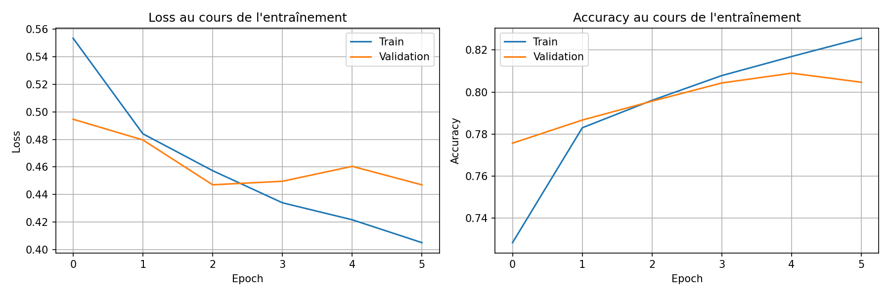

```
  edge_case                     : 100.00% (1 ex.)
  hard                          : 93.52% (540 ex.)
  longterm_with_amulet_hard     : 99.80% (495 ex.)
  longterm_without_amulet_hard  : 30.51% (495 ex.)
  normal_short                  : 93.11% (450 ex.)
  order_trap_die_hard           : 83.75% (480 ex.)
  order_trap_survive_hard       : 80.62% (480 ex.)
  random                        : 93.22% (59 ex.)
Paramètres: 9,709
```

* **Iteration 2**
```bash
uv run .\train_dungeon_logs.py --embed_dim 16 --hidden_dim 32
```

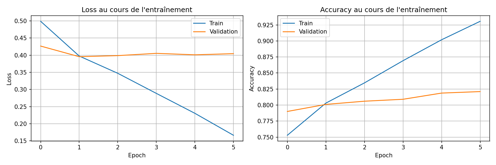

```
  edge_case                     : 100.00% (1 ex.)
  hard                          : 95.37% (540 ex.)
  longterm_with_amulet_hard     : 77.98% (495 ex.)
  longterm_without_amulet_hard  : 58.99% (495 ex.)
  normal_short                  : 89.78% (450 ex.)
  order_trap_die_hard           : 86.04% (480 ex.)
  order_trap_survive_hard       : 82.71% (480 ex.)
  random                        : 93.22% (59 ex.)
Paramètres: 73,521
```

* **Iteration 3**
```bash
uv run .\train_dungeon_logs.py --embed_dim 16 --hidden_dim 128
```

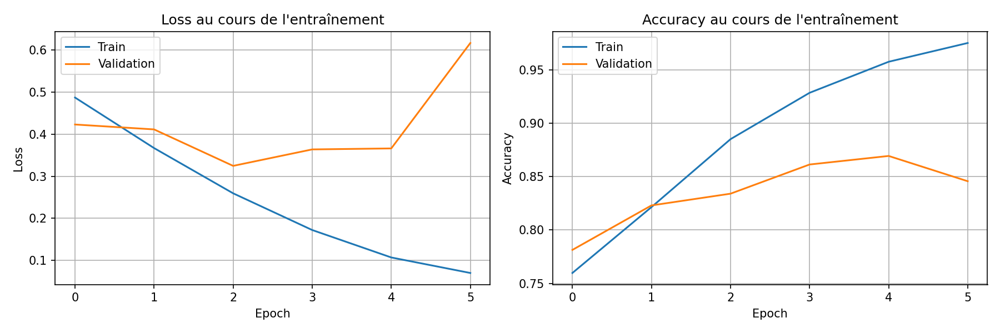

```
  edge_case                     : 100.00% (1 ex.)
  hard                          : 93.70% (540 ex.)
  longterm_with_amulet_hard     : 99.80% (495 ex.)
  longterm_without_amulet_hard  : 54.55% (495 ex.)
  normal_short                  : 92.22% (450 ex.)
  order_trap_die_hard           : 83.33% (480 ex.)
  order_trap_survive_hard       : 83.54% (480 ex.)
  random                        : 84.75% (59 ex.)
Paramètres: 304,209
```

**Conclusion `--hidden_dim`**

On observe qu'avec le nombre de paramètres et les valeurs obtenues, on peut conserver comme valeur de paramètre 4.

### `--num_layers`

> Objectif : avoir un nombre de couches suffisant pour capturer des motifs complexes dans la séquence, mais éviter d’ajouter trop de couches qui pourraient ralentir l'entraînement et rendre le modèle difficile à entraîner.

* **Iteration 1**
```bash
uv run .\train_dungeon_logs.py --embed_dim 16 --hidden_dim 4 --num_layers 1
```

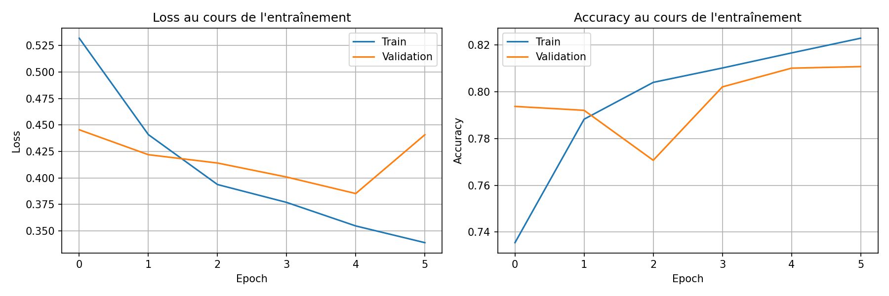

```
  edge_case                     : 100.00% (1 ex.)
  hard                          : 94.07% (540 ex.)
  longterm_with_amulet_hard     : 94.95% (495 ex.)
  longterm_without_amulet_hard  : 35.96% (495 ex.)
  normal_short                  : 89.33% (450 ex.)
  order_trap_die_hard           : 85.21% (480 ex.)
  order_trap_survive_hard       : 85.42% (480 ex.)
  random                        : 91.53% (59 ex.)
Paramètres: 9,709
```

* **Iteration 2**
```bash
uv run .\train_dungeon_logs.py --embed_dim 16 --hidden_dim 4 --num_layers 3
```


```
  edge_case                     : 100.00% (1 ex.)
  hard                          : 93.52% (540 ex.)
  longterm_with_amulet_hard     : 96.36% (495 ex.)
  longterm_without_amulet_hard  : 33.94% (495 ex.)
  normal_short                  : 92.67% (450 ex.)
  order_trap_die_hard           : 84.38% (480 ex.)
  order_trap_survive_hard       : 80.00% (480 ex.)
  random                        : 84.75% (59 ex.)
Paramètres: 9,709
```

* **Iteration 3**
```bash
uv run .\train_dungeon_logs.py --embed_dim 16 --hidden_dim 4 --num_layers 4
```

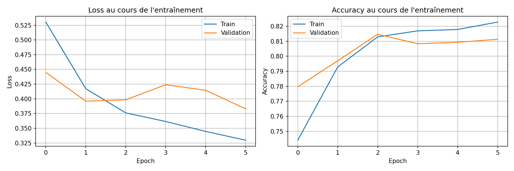

```
  edge_case                     : 100.00% (1 ex.)
  hard                          : 93.70% (540 ex.)
  longterm_with_amulet_hard     : 91.11% (495 ex.)
  longterm_without_amulet_hard  : 36.16% (495 ex.)
  normal_short                  : 91.78% (450 ex.)
  order_trap_die_hard           : 88.12% (480 ex.)
  order_trap_survive_hard       : 85.21% (480 ex.)
  random                        : 88.14% (59 ex.)
Paramètres: 9,709
```

**Conclusion `--num_layers`**

On observe qu'avec le nombre de paramètres et les valeurs obtenues, on peut conserver comme valeur de paramètre 3.

### `--dropout`

> Objectif : utiliser un taux de dropout optimal pour prévenir l'overfitting sans nuire à la capacité d'apprentissage du modèle. Un taux trop élevé pourrait ralentir la convergence, tandis qu’un taux trop faible pourrait conduire à un sur-apprentissage.

* **Iteration 1**
```bash
uv run .\train_dungeon_logs.py --embed_dim 16 --hidden_dim 4 --num_layers 3 --dropout 0.1
```

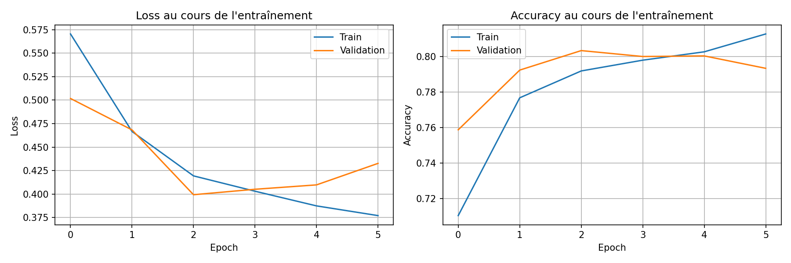

```
  edge_case                     : 100.00% (1 ex.)
  hard                          : 91.48% (540 ex.)
  longterm_with_amulet_hard     : 99.80% (495 ex.)
  longterm_without_amulet_hard  : 31.11% (495 ex.)
  normal_short                  : 92.67% (450 ex.)
  order_trap_die_hard           : 77.50% (480 ex.)
  order_trap_survive_hard       : 82.71% (480 ex.)
  random                        : 86.44% (59 ex.)
Paramètres: 9,709
```

* **Iteration 2**
```bash
uv run .\train_dungeon_logs.py --embed_dim 16 --hidden_dim 4 --num_layers 3 --dropout 0.6
```

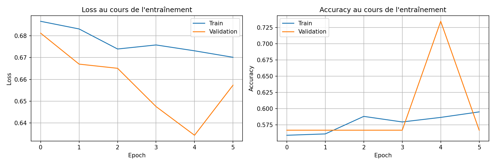

```
  edge_case                     : 0.00% (1 ex.)
  hard                          : 89.44% (540 ex.)
  longterm_with_amulet_hard     : 0.00% (495 ex.)
  longterm_without_amulet_hard  : 69.70% (495 ex.)
  normal_short                  : 20.00% (450 ex.)
  order_trap_die_hard           : 81.25% (480 ex.)
  order_trap_survive_hard       : 71.67% (480 ex.)
  random                        : 81.36% (59 ex.)
Paramètres: 9,709
```

* **Iteration 3**
```bash
uv run .\train_dungeon_logs.py --embed_dim 16 --hidden_dim 4 --num_layers 3 --dropout 0.3
```

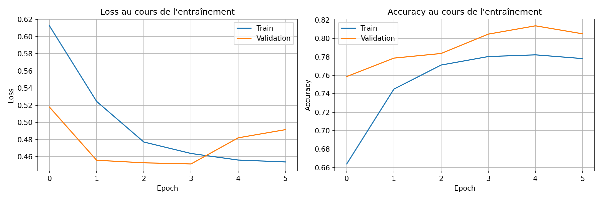

```
  edge_case                     : 100.00% (1 ex.)
  hard                          : 93.70% (540 ex.)
  longterm_with_amulet_hard     : 100.00% (495 ex.)
  longterm_without_amulet_hard  : 30.30% (495 ex.)
  normal_short                  : 91.56% (450 ex.)
  order_trap_die_hard           : 83.54% (480 ex.)
  order_trap_survive_hard       : 82.92% (480 ex.)
  random                        : 88.14% (59 ex.)
Paramètres: 9,709
```

**Conclusion `--dropout`**

On observe qu'avec le nombre de paramètres et les valeurs obtenues, on peut conserver comme valeur de paramètre 0.3.

### `--epochs`

> Objectif : définir un nombre d’époques suffisant pour permettre au modèle d'apprendre correctement sans sur-apprentissage. Un nombre trop faible pourrait signifier que le modèle ne s’est pas suffisamment entraîné, tandis qu’un nombre trop élevé pourrait entraîner un overfitting

```bash
uv run .\train_dungeon_logs.py --embed_dim 16 --hidden_dim 4 --num_layers 3 --dropout 0.3 --epochs 50
```

**Conclusion `--epochs`**

On fixe la valeur du paramètre à 50 pour laisser le temps au modèle d'apprendre mais en le limitant pour minimiser le risque de sur-apprentissage.

### `--mode`

> Objectif :hoisir une architecture adaptée à la complexité de la séquence. linear pour des relations simples, rnn pour des dépendances temporelles simples, et lstm pour des dépendances longues ou complexes

* **Iteration 1**
```bash
uv run .\train_dungeon_logs.py --embed_dim 16 --hidden_dim 4 --num_layers 3 --dropout 0.3 --epochs 50 --mode linear
```

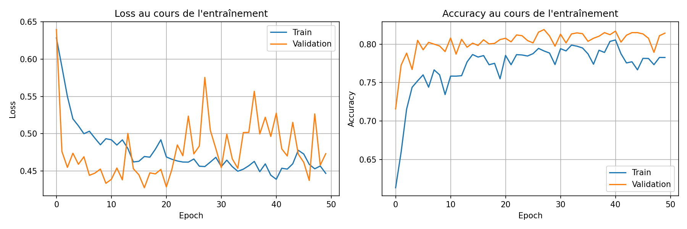

* **Iteration 2**
```bash
uv run .\train_dungeon_logs.py --embed_dim 16 --hidden_dim 4 --num_layers 3 --dropout 0.3 --epochs 50 --mode rnn
```

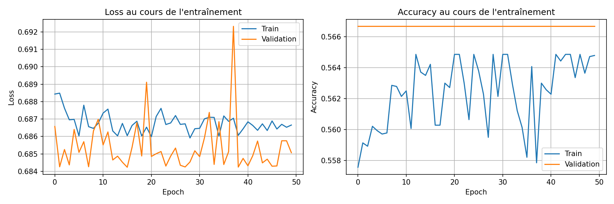

* **Iteration 3**
```bash
uv run .\train_dungeon_logs.py --embed_dim 16 --hidden_dim 4 --num_layers 3 --dropout 0.3 --epochs 50 --mode lstm
```

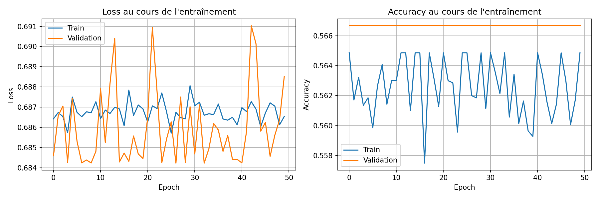

**Conclusion `--mode`**

On observe qu'avec le nombre de paramètres et les valeurs obtenues, on peut conserver comme valeur de paramètre lstm.


### `--bidirectionnal`

> Objectif : activer le mode bidirectionnel pour mieux capturer les dépendances des événements futurs dans la séquence, particulièrement utile lorsque la séquence a des relations entre les étapes passées et futures.

```bash
uv run .\train_dungeon_logs.py --embed_dim 16 --hidden_dim 4 --num_layers 3 --dropout 0.3 --epochs 50 --mode lstm --bidirectionnal
```

**Conclusion `--bidirectionnal`**

On fixe la valeur du paramètre à Vraie pour prendre en compte la relation entre l'ordre des étapes d'un donjon (ex : `dragon -> potion` est différent de `potion -> dragon`)

### `--bidirectionnal`

> Objectif : activer le mode bidirectionnel pour mieux capturer les dépendances des événements futurs dans la séquence, particulièrement utile lorsque la séquence a des relations entre les étapes passées et futures.

```bash
uv run .\train_dungeon_logs.py --embed_dim 16 --hidden_dim 4 --num_layers 3 --dropout 0.3 --epochs 50 --mode lstm --bidirectionnal
```

**Conclusion `--bidirectionnal`**

On fixe la valeur du paramètre à Vraie pour prendre en compte la relation entre l'ordre des étapes d'un donjon (ex : `dragon -> potion` est différent de `potion -> dragon`)

### `--batch_size`

> Objectif : choisir une taille de lot qui équilibre la stabilité de l’apprentissage et l’efficacité de la mémoire. Des lots plus grands permettent des calculs plus rapides, mais peuvent augmenter la consommation mémoire, tandis que des lots plus petits peuvent rendre l’apprentissage plus précis mais plus lent.

**Conclusion `--batch_size`**

On laisse la valeur par défaut pour le moment.

### `--learning_rate`

> Objectif : ajuster le taux d'apprentissage pour une convergence rapide sans trop sauter autour du minimum optimal. Un taux trop élevé peut empêcher la convergence, tandis qu’un taux trop faible peut rendre l’entraînement trop lent.

**Conclusion `--learning_rate`**

On laisse la valeur par défaut pour le moment.`

### `--patience`

> Objectif : définir un nombre raisonnable d’époques sans amélioration avant d'arrêter l'entraînement, permettant au modèle de récupérer d'éventuelles baisses temporaires de performance tout en prévenant l’overfitting.

**Conclusion `--patience`**

On laisse la valeur par défaut pour le moment.

### `--early_stopping`

> Objectif : activer l'arrêt précoce pour stopper l’entraînement dès que le modèle cesse de s'améliorer, afin d’éviter de gaspiller du temps de calcul et de prévenir l'overfitting.

```bash
uv run .\train_dungeon_logs.py --embed_dim 16 --hidden_dim 4 --num_layers 3 --dropout 0.3 --epochs 50 --mode lstm --bidirectionnal --early_stopping
```

**Conclusion `--early_stopping`**

On active l'early_stopping pour s'arrêter selon la valeur du paramètre `--patience`

### `--optimizer`

> Objectif : choisir un optimiseur qui s’adapte bien au problème à résoudre. adam est généralement plus performant pour les données complexes et les réseaux profonds, tandis que sgd peut être plus simple et plus rapide pour des modèles moins complexes.

* **Iteration 1**
```bash
uv run .\train_dungeon_logs.py --embed_dim 16 --hidden_dim 4 --num_layers 3 --dropout 0.3 --epochs 50 --mode lstm --bidirectionnal --early_stopping --optimizer adam
```

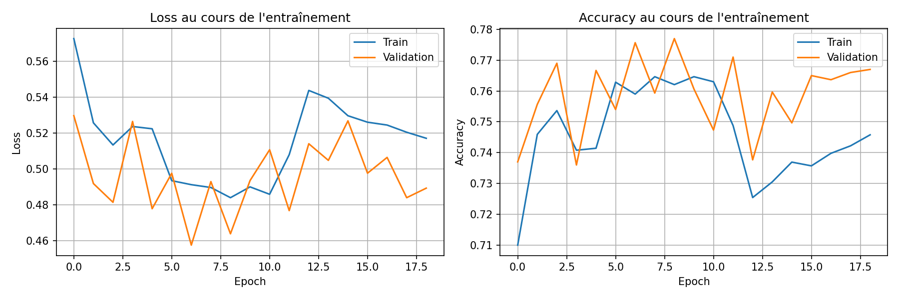

```
  edge_case                     : 100.00% (1 ex.)
  hard                          : 86.85% (540 ex.)
  longterm_with_amulet_hard     : 100.00% (495 ex.)
  longterm_without_amulet_hard  : 30.30% (495 ex.)
  normal_short                  : 85.78% (450 ex.)
  order_trap_die_hard           : 82.50% (480 ex.)
  order_trap_survive_hard       : 73.96% (480 ex.)
  random                        : 83.05% (59 ex.)
Paramètres: 11,318
```

* **Iteration 2**
```bash
uv run .\train_dungeon_logs.py --embed_dim 16 --hidden_dim 4 --num_layers 3 --dropout 0.3 --epochs 50 --mode lstm --bidirectionnal --early_stopping --optimizer sgd
```

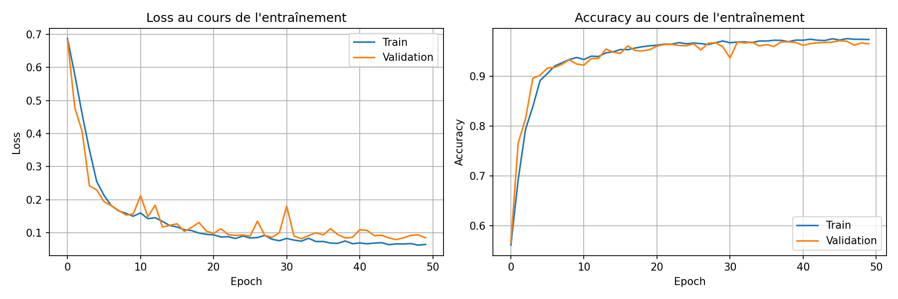

```
  edge_case                     : 100.00% (1 ex.)
  hard                          : 97.22% (540 ex.)
  longterm_with_amulet_hard     : 100.00% (495 ex.)
  longterm_without_amulet_hard  : 99.60% (495 ex.)
  normal_short                  : 96.44% (450 ex.)
  order_trap_die_hard           : 93.96% (480 ex.)
  order_trap_survive_hard       : 91.46% (480 ex.)
  random                        : 96.61% (59 ex.)
Paramètres: 11,318
```

**Conclusion `--optimizer`**

On observe qu'avec le nombre de paramètres et les valeurs obtenues, on peut conserver comme valeur de paramètre adam.

### `--weight_decay`

> Objectif : appliquer une régularisation légère pour éviter l’overfitting, sans trop pénaliser les poids. Trop de régularisation peut ralentir l’apprentissage et empêcher le modèle d’apprendre correctement.

* **Iteration 1**
```bash
uv run .\train_dungeon_logs.py --embed_dim 16 --hidden_dim 4 --num_layers 3 --dropout 0.3 --epochs 50 --mode lstm --bidirectionnal --early_stopping --optimizer adam --weight_decay 0.001
```

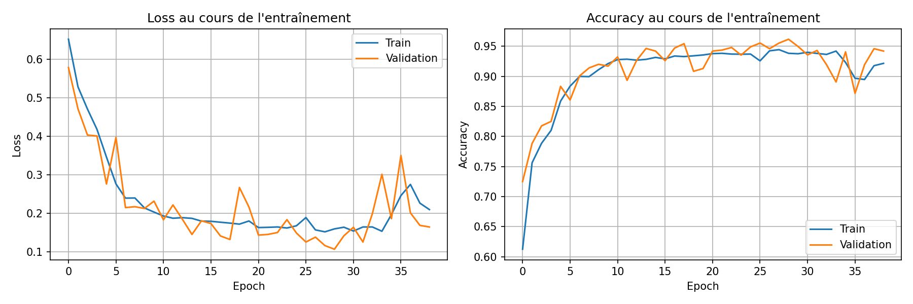

```
  edge_case                     : 100.00% (1 ex.)
  hard                          : 96.30% (540 ex.)
  longterm_with_amulet_hard     : 99.80% (495 ex.)
  longterm_without_amulet_hard  : 91.72% (495 ex.)
  normal_short                  : 94.89% (450 ex.)
  order_trap_die_hard           : 92.71% (480 ex.)
  order_trap_survive_hard       : 89.58% (480 ex.)
  random                        : 93.22% (59 ex.)
Paramètres: 11,318
```

* **Iteration 2**
```bash
uv run .\train_dungeon_logs.py --embed_dim 16 --hidden_dim 4 --num_layers 3 --dropout 0.3 --epochs 50 --mode lstm --bidirectionnal --early_stopping --optimizer adam --weight_decay 0.0001
```

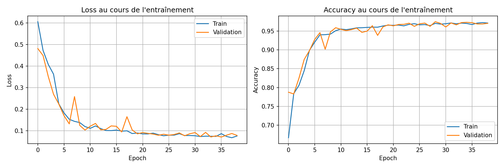

```
  edge_case                     : 100.00% (1 ex.)
  hard                          : 97.04% (540 ex.)
  longterm_with_amulet_hard     : 100.00% (495 ex.)
  longterm_without_amulet_hard  : 99.60% (495 ex.)
  normal_short                  : 95.33% (450 ex.)
  order_trap_die_hard           : 96.25% (480 ex.)
  order_trap_survive_hard       : 93.54% (480 ex.)
  random                        : 98.31% (59 ex.)
Paramètres: 11,318
```

**Conclusion `--weight_decay`**

On observe qu'avec le nombre de paramètres et les valeurs obtenues, on peut conserver comme valeur de paramètre 0.0001.

### `--use_scheduler`

> Objectif : activer un scheduler pour ajuster dynamiquement le taux d’apprentissage et améliorer la convergence du modèle, en réduisant progressivement le taux d’apprentissage à mesure que l’entraînement progresse.

* **Iteration 1**
```bash
uv run .\train_dungeon_logs.py --embed_dim 16 --hidden_dim 4 --num_layers 3 --dropout 0.3 --epochs 50 --mode lstm --bidirectionnal --early_stopping --optimizer adam --weight_decay 0.0001 --use_scheduler
```

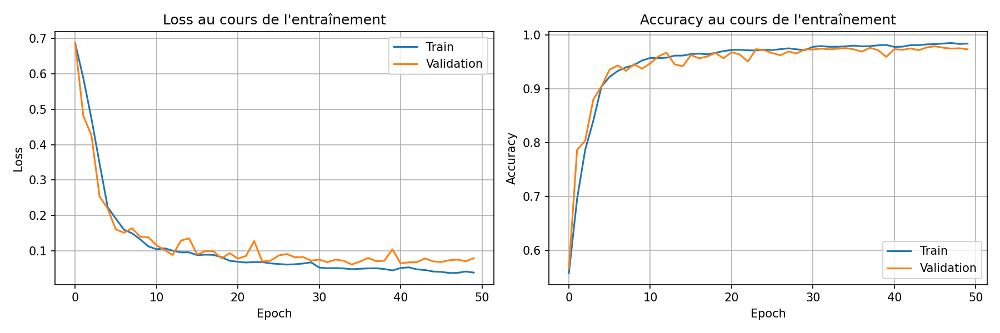

```
  edge_case                     : 100.00% (1 ex.)
  hard                          : 97.59% (540 ex.)
  longterm_with_amulet_hard     : 100.00% (495 ex.)
  longterm_without_amulet_hard  : 99.60% (495 ex.)
  normal_short                  : 96.67% (450 ex.)
  order_trap_die_hard           : 96.04% (480 ex.)
  order_trap_survive_hard       : 93.96% (480 ex.)
  random                        : 98.31% (59 ex.)
Paramètres: 11,318
```

**Conclusion `--use_scheduler`**

On observe qu'avec le nombre de paramètres et les valeurs obtenues, on peut conserver comme valeur de paramètre vrai.

### **Remarque**

On met à jour la valeur du paramètre `embed_dim` pour réduire le nombre de paramètres et améliorer le ratio accuracy / taille et on augmente la valeur de `patience` à 20.

```bash
uv run .\train_dungeon_logs.py --embed_dim 8 --hidden_dim 4 --num_layers 3 --dropout 0.3 --epochs 50 --mode lstm --bidirectionnal --early_stopping --optimizer adam --weight_decay 0.0001 --use_scheduler --patience 20
```

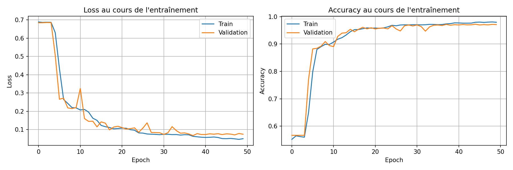

Après dépôt sur le site, on obtient le résultat suivant avec le modèle généré par la commande ci-dessus.

| Val Acc (%) | Test Secret (%) | Gap (%) | Params |
|-------------|-----------------|---------|--------|
| 97.23 | 97 | 0.23 | 6222 |
